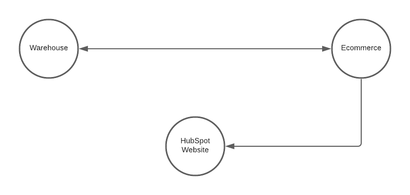

# Project

## Overview
This purpose of this project is to setup an ecommerce store on Shopify with a public facing website to be hosted on HubSpot CMS. As needed an integration between the client's warehouse and Shopify store will need to be developed.

## System Components
### Ecommerce
Ecommerce is the primary component of the system. Ecommerce will be implemented using a Shopify store. Shopify is a cloud based ecommerce service where store owners can sell their products online. 

#### Functional Requirements
- Store should have an admin dashboard where store onwer can manage products & their categories/collections, customers, and products.
- Store owner should be able to add product inventory manually. The inventory should automatically sync between the store and the warehouse.
- Customers should be able to browse products on the online store, filter them by category, and filter them based on other filtering options Shopify offers out of the box.
- Store owner should be able to withdraw earnings using one of the supported Shopify withdrawing channels.

#### Non-functional Requirements
- Store should be secure.
- Store should be scalable.
- Store should have a 99.99% uptime.

